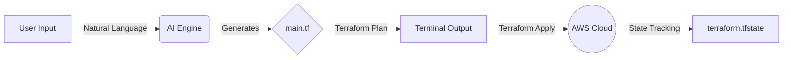

<h1 align="center">
  InfraSmith
</h1>

<p align="center">
  <strong>Text-to-Infrastructure</strong><br>
  Spin up AWS resources simply by describing them.
</p>

<p align="center">
  
  
  
</p>

<h3 align="center">
  <a href="#-overview">Overview</a>
  <span> • </span>
  <a href="#-how-it-works">How It Works</a>
  <span> • </span>
  <a href="#-key-features">Features</a>
  <span> • </span>
  <a href="#-roadmap">Roadmap</a>
  <span> • </span>
  <a href="#-important-notes">Notes</a>
</h3>

---

## 📖 Overview

InfraSmith acts as an intelligent bridge between **natural language** and **real-world cloud infrastructure**.

Instead of writing complex HCL manually, simply describe what you need:

> *"I need an S3 bucket for testing"*

The system automatically:
- generates Terraform code
- provisions infrastructure
- manages lifecycle

Perfect for **rapid prototyping, testing, and developers without deep Terraform expertise**.

---

## 🏗 How It Works

This diagram illustrates the flow from natural language input to cloud infrastructure deployment.



## 🚀 Key Features

### ✅ Natural Language Provisioning
Type requirements in plain English and get valid Terraform automatically.

### ✅ Automated Deployment (Zero-Touch)
Runs the full lifecycle:
* Init
* Plan
* Apply

### ✅ Live Execution Logs
Streams Terraform logs directly to your terminal for transparency.

### ✅ State Management & Destruction
* Persistence via `terraform.tfstate`
* Easy cleanup to avoid billing

## 🗺️ Roadmap

| Feature | Status | Description |
|---------|--------|-------------|
| Editable main.tf | 🚧 Coming Soon | Modify generated Terraform before apply |
| Control Dashboard | 📅 Planned | GUI for deployments & state |
| Interactive UI | 📅 Planned | Web-based experience |

## 💬 Example Workflow
```
Code

You: "Spin up a private S3 bucket in us-east-1"
AI:  Generating configuration... Deploying resources...
```

## ⚠️ Important Notes

* **Cost Warning:** Creates real AWS resources → charges may apply
* **State File:** Do NOT delete `terraform.tfstate`

